## Modern Agent Overview

An AI agent is an autonomous system designed to execute tasks for users.
In LLM-based agents, the language model acts as the brain, planning next steps, choosing tools, and dynamically interacting with the environment based on feedback.
Unlike traditional software workflows that follow predefined and deterministic rules, modern agents can make autonomous decisions and interact with dynamic and uncertain environments.

- Agents are “systems that independently accomplish tasks on your behalf.” ([OpenAI](https://openai.com/business/guides-and-resources/a-practical-guide-to-building-ai-agents/))
- Agents are “systems where LLMs dynamically direct their own processes and tool usage, maintaining control over how they accomplish tasks.” ([Anthropic](https://www.anthropic.com/engineering/building-effective-agents))

<p align="center">
  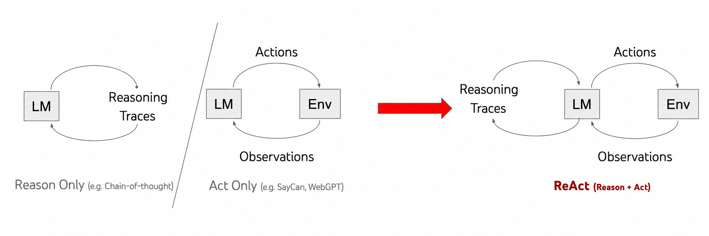
</p>

_Figure 1. ReAct illustrates how environment observations guide subsequent reasoning and actions._ (Image source: [Yao et al. 2023](https://arxiv.org/abs/2210.03629))

The execution of complex tasks typically requires multi-step exploration and planning.
Consider, for example, a search agent that retrieves information from the web to answer user queries.
At each step, the agent searches the web, extracts relevant information, reasons over the current context, and determines the next action.
In this loop, the query and the resulting sequence of observations and actions form a **trajectory**.
As an illustration, <a href="{{ '/blog/2026/scaling-training-data-for-agent-learning/assets/search.html' | relative_url }}" target="_blank" rel="noopener">this demonstration</a> showcases a search agent's long-horizon trajectory in a real-world setting. The interactive replay is embedded below.

<div class="interactive-demo">
  <div class="interactive-demo-bar">
    <span class="interactive-demo-controls" aria-hidden="true"><span></span><span></span><span></span></span>
    <span class="interactive-demo-title">Interactive search agent trajectory</span>
    <a class="interactive-demo-open" href="{{ '/blog/2026/scaling-training-data-for-agent-learning/assets/search.html' | relative_url }}" target="_blank" rel="noopener">Open in new window ↗</a>
  </div>
  <iframe src="{{ '/blog/2026/scaling-training-data-for-agent-learning/assets/search.html' | relative_url }}" title="Interactive replay of a web-search agent trajectory" loading="lazy" sandbox="allow-scripts"></iframe>
</div>

To empower language models with native agentic capabilities, agent training plays a critical role in aligning the model with interactive environments and fostering robust tool-use behaviors.

Agent training typically involves two common paradigms: supervised fine-tuning (SFT) and reinforcement learning (RL). Given well-crafted trajectories, SFT trains the model to imitate demonstrated behaviors by predicting the next action conditioned on the prior interaction history.
Unlike SFT, RL allows an agent to learn through trial and error from environment feedback and reward signals, reducing its dependence on curated expert demonstrations. However, agent RL still requires suitable tasks, executable environments, and reliable reward or verification signals, and it often benefits from an SFT-initialized policy.
While SFT depends heavily on high-quality demonstration data, it typically incurs relatively modest training compute.
In contrast, RL can reduce the need for expert-generated trajectories but generally demands substantially higher computational resources due to repeated online rollouts and environment feedback.
Consequently, model developers often adopt SFT as a cost-effective way to improve agent capabilities, driving growing interest in constructing high-quality agent training data efficiently and at scale.

In this blog post, we survey the literature on agent training data through the lens of trajectory construction, categorizing existing methods into four paradigms: Human Demonstration Collection, Expert Trajectory Collection, On-policy Trajectory Collection, and Simulator-Based Trajectory Collection.

## Agent Training Data Construction

Agent training data construction converts raw interaction histories into structured trajectories from which language models can effectively learn.
A typical supervised fine-tuning (SFT) example interleaves the user task, the agent's reasoning, tool calls, and the resulting observations, preserving the context needed to predict the next step.
<a href="{{ '/blog/2026/scaling-training-data-for-agent-learning/assets/sft_data.html' | relative_url }}" target="_blank" rel="noopener">This SFT training data example</a> illustrates this format across a complete search agent trajectory, where messages are organized by conversational roles and tool calls are paired with environment observations. The interactive example is embedded below.

<div class="interactive-demo">
  <div class="interactive-demo-bar">
    <span class="interactive-demo-controls" aria-hidden="true"><span></span><span></span><span></span></span>
    <span class="interactive-demo-title">Interactive SFT training-data example</span>
    <a class="interactive-demo-open" href="{{ '/blog/2026/scaling-training-data-for-agent-learning/assets/sft_data.html' | relative_url }}" target="_blank" rel="noopener">Open in new window ↗</a>
  </div>
  <iframe src="{{ '/blog/2026/scaling-training-data-for-agent-learning/assets/sft_data.html' | relative_url }}" title="Interactive example of supervised fine-tuning data for an agent" loading="lazy" sandbox="allow-scripts"></iframe>
</div>

Below, we discuss how different collection strategies generate and curate these trajectories.

### Human Demonstration Collection

Human supervision serves as the foundational paradigm for demonstration collection. A straightforward way to construct such data is to have human annotators perform tasks within an environment while recording their interactive behaviors. Each resulting demonstration pairs a task instruction with the sequence of observations and actions encountered during execution. These records provide direct supervision for imitation learning, where the agent is trained to predict the next human action conditioned on the task goal and interaction history.

<p align="center">
  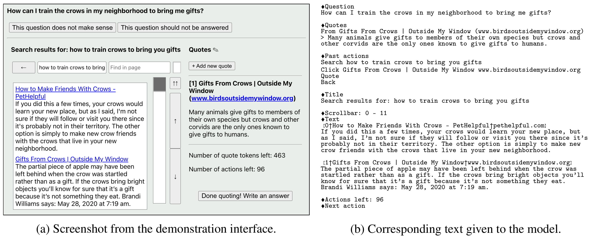
</p>

_Figure 2. WebGPT presents the same browsing state through a graphical interface for human demonstrators (left) and a text representation for the model (right)._ (Image source: [Nakano et al. 2021](https://arxiv.org/abs/2112.09332))

[WebGPT](https://arxiv.org/abs/2112.09332) is a pioneering web-browsing agent designed to answer long-form questions using a text-based environment.
Human labelers used a GUI-based browsing interface to search the web, navigate pages, collect references, and write final answers. To enable the language model to learn from these interactions, the developers converted the human browsing trajectories collected through the GUI into text trajectories suitable for model training. They collected around 6,000 human demonstrations and fine-tuned GPT-3 to imitate these trajectories. To further improve performance at inference time, the authors used best-of-N sampling and selected the answer ranked highest by the reward model.
Constrained by the model capabilities of its era, WebGPT struggled with generalization and reasoning.
Nonetheless, WebGPT established an early paradigm for language models to act as search agents through iterative interaction with the web.

<p align="center">
  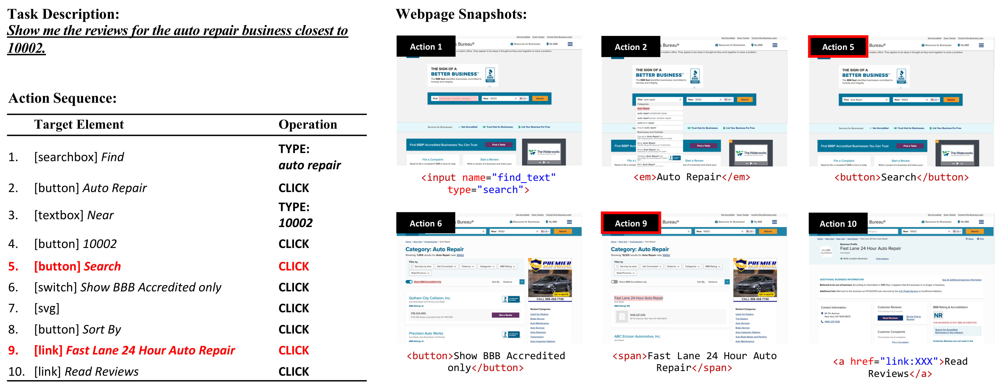
</p>

_Figure 3. A web-agent data example containing a task description, an action sequence, and webpage snapshots that record the observations at different steps._ (Image source: [Deng et al. 2023](https://arxiv.org/abs/2306.06070))

[Mind2Web](https://arxiv.org/abs/2306.06070) introduces a dataset of human demonstrations for real-world web navigation.
Annotators design diverse tasks across real websites and perform the actions required to complete them.
After rigorous verification, the authors refine task descriptions and remove extraneous actions.
The resulting dataset contains 2,350 tasks across 137 websites and 31 domains.
Each instance contains a high-level task description and an action sequence consisting of target webpage elements and operations such as clicking, typing, and selecting options.
Webpage snapshots are recorded at each step to preserve the execution context for every action.
The constructed trajectories are used to train MindAct, which takes the task instruction, webpage state, and previous actions as input and predicts the next target element and action.
To handle the vast number of elements on real-world webpages, MindAct first employs a fine-tuned small language model to rank the elements and identify a subset of promising candidates.
These candidates are subsequently provided to an LLM, which selects the target element and predicts the corresponding action.
While Mind2Web demonstrates promising action-prediction performance, results remain limited on cross-website and cross-domain splits, leaving substantial room for generalization to complex web tasks.

<p align="center">
  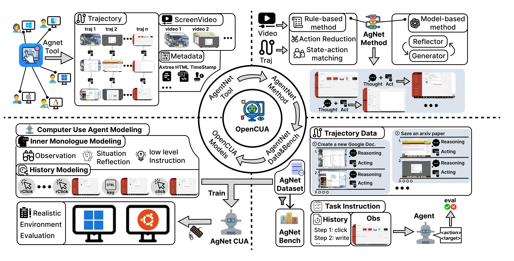
</p>

_Figure 4. OpenCUA framework records human desktop interactions and converts them into compact, reasoning-augmented trajectories for agent training and evaluation._ (Image source: [Wang et al. 2025](https://arxiv.org/abs/2508.09123))

[OpenCUA](https://arxiv.org/abs/2508.09123) constructs AgentNet from real human computer-use demonstrations across Windows, macOS, and Ubuntu. During data collection, AgentNetTool records screen videos, mouse and keyboard events, and accessibility trees. These raw interactions are subsequently converted into compact state-action trajectories, consolidating fine-grained mouse and keyboard inputs into executable GUI actions (e.g., `click(x, y)`, `write("text")`, and `scroll(...)`). Each action is aligned with the latest visually distinct screenshot preceding its execution, yielding step-by-step trajectories of computer states and human actions. Furthermore, OpenCUA leverages Claude 3.7 Sonnet to synthesize reflective reasoning for each step—describing current observations, evaluating past actions, and outlining subsequent steps.
This synthesized rationale encourages the model to interpret visual observations, reflect on prior operations, and plan the next action, thereby improving generalization and execution robustness across complex computer-use environments.

Human demonstrations provide high-quality task execution trajectories grounded in actual environment interactions, but collecting them is labor-intensive and costly. Each trajectory requires annotators to perform tasks manually, with additional effort often needed to review and clean the recorded interactions. A robotics example illustrates this broader scalability gap: NVIDIA reports generating approximately 780,000 synthetic manipulation trajectories in 11 hours, equivalent to about 6,500 hours of human demonstration data ([NVIDIA](https://developer.nvidia.com/blog/building-a-synthetic-motion-generation-pipeline-for-humanoid-robot-learning)).
These scalability bottlenecks motivate automated dataset construction by leveraging highly capable models to interact with environments, leading to the paradigm of Expert Trajectory Collection.

### Expert Trajectory Collection

Expert trajectory collection uses an advanced teacher model as the trajectory generator.
Given a task, the model selects actions, receives observations from tools or the task environment, and continues until completion or a stopping limit.
The resulting trajectories are evaluated and selected for training a student model. Here, “expert” refers to the teacher’s role, rather than a guarantee that its actions are correct. Verification is therefore an essential part of data construction.

<p align="center">
  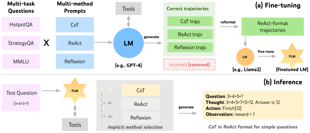
</p>

_Figure 5. FireAct: (a) GPT-4 generates successful trajectories from diverse datasets and prompting methods to fine-tune a smaller LM in ReAct format. (b) The fine-tuned LM completes ReAct tasks without few-shot prompts, adaptively selecting prompting methods and trajectory lengths._ (Image source: [Chen et al. 2023](https://arxiv.org/abs/2310.05915))

[FireAct](https://arxiv.org/abs/2310.05915) aims to build native language agents by fine-tuning LMs on multi-turn agentic trajectories generated by proprietary models.
FireAct uses GPT-4 as an expert agent to solve existing QA tasks in a real search environment and automatically collect interaction trajectories.
To increase training data diversity, FireAct unifies diverse task formats and prompting schemes (e.g., ReAct, Reflexion).
The successful trajectories generated are retained as training data for supervised fine-tuning.
Empirical results demonstrate that fine-tuning language agents improves performance on downstream benchmarks while substantially reducing inference latency.
In practice, FireAct represents an early step toward building native agents by fine-tuning language models on trajectories generated by expert models.

<p align="center">
  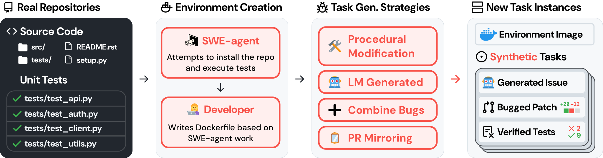
</p>

_Figure 6. SWE-smith creates training data for software engineering agents by crafting bugs into real codebases. Given a codebase, SWE-smith employs several strategies to create task instances that break existing tests._ (Image source: [Yang et al. 2025](https://arxiv.org/abs/2504.21798))

[SWE-smith](https://arxiv.org/abs/2504.21798) is a framework built to generate training data for software engineering agents at scale. It sources codebases from real Python repositories, installs dependencies, and runs tests using SWE-agent.
After manual verification, these environments are packaged into Docker images.
Repair tasks are generated by introducing code defects that break previously passing tests and pairing them with model-generated issue descriptions. SWE-smith generates candidate code modifications and retains those that cause previously passing tests to fail. Next, an LLM synthesizes realistic issue descriptions from the code diffs and failing tests, packaging them into self-contained repair tasks.
The generated trajectories are evaluated against the task tests, and only successful runs are retained, yielding 5,016 expert trajectories for student model training.

<p align="center">
  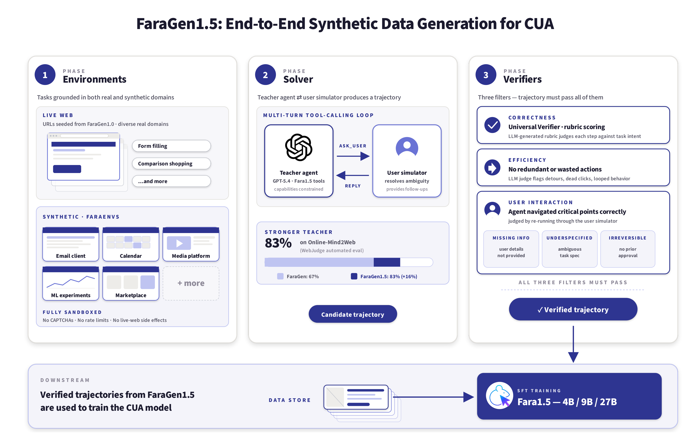
</p>

_Figure 7. FaraGen1.5 pipeline: Phase 1 instantiates tasks in live and sandboxed environments; Phase 2 uses a GPT-5.4-based solver to attempt tasks in cooperation with a user simulator; Phase 3 admits a trajectory only if it passes correctness, efficiency, and critical-point adherence verifiers._ (Image source: [Awadallah et al. 2026](https://arxiv.org/abs/2606.20785))

**[FaraGen1.5](https://arxiv.org/abs/2606.20785)** is a scalable data pipeline for computer-use agents composed of three modular components: environments, solvers, and verifiers.
The environments consist of live websites for open web tasks and synthetic sandboxed websites for tasks involving authentication and irreversible actions. For live websites, an LLM generates realistic tasks based on summaries of each website’s content, features, and structure.
For synthetic environments, the authors use an agent to build website replicas with a FastAPI backend and a SQLite database, allowing each task to have a verifiable success criterion.
A GPT-5.4-based solver interacts with these environments through browser actions, while a user simulator can also provide adjustments or follow-up requests to generate multi-turn trajectories.
The resulting trajectories are filtered by three independent verifiers that evaluate task correctness, interaction efficiency, and critical-point adherence.
The data collection pipeline has accumulated roughly 1.57 million trajectory steps, which were used to train Fara1.5 models using Qwen3.5 as the base model.
Fine-tuning Qwen3.5 9B on these trajectories improves the task success rate on live websites from 73.4% to 83.4%, demonstrating the practical effectiveness of this data pipeline.

While expert trajectory collection scales data generation without manual intervention, it still requires teacher inference, environment execution, and reliable evaluators. More fundamentally, relying on expert rollouts induces severe distribution mismatch: the student model may deviate from the teacher's path during execution, reaching unfamiliar states never encountered during training. This limitation motivates **On-policy Trajectory Collection**.

### On-policy Trajectory Collection

On-policy trajectory collection gathers data by rolling out the current policy in the environment.
Unlike expert demonstrations, which contain states visited by the expert, on-policy rollouts capture the state distribution induced by the agent itself. This is important because errors made during execution can lead the agent to states that are not covered by offline demonstrations, causing errors to compound over long-horizon tasks. Two common approaches are to filter successful trajectories using environment feedback, or to query an expert for corrective actions on states visited by the student policy.

[SWE-Gym](https://proceedings.mlr.press/v267/pan25g.html) constructs executable software engineering environments from real GitHub issues, enabling agents to interact with repositories and receive verifiable feedback through unit tests.
The authors collect successful trajectories from strong expert models and use them for rejection sampling fine-tuning, achieving substantial improvements over the base model.
Beyond expert rejection sampling, the authors explore on-policy self-improvement by training the agent on successful trajectories generated by the base model itself.
However, naively training on successful on-policy trajectories does not consistently improve performance.
Experimental analysis shows that repeated rejection sampling can bias the training data toward easier tasks, since these tasks are more likely to yield successful trajectories.
This indicates that on-policy self-improvement is constrained by the current policy capacity.
Specifically, successful rollouts predominantly concentrate on tasks the model can already master, leaving harder instances underrepresented and providing limited learning signals.

[OpenWebVoyager](https://arxiv.org/abs/2410.19609) investigates a framework built around an exploration-feedback-optimization cycle for multimodal web agents operating in real-world environments.
Instead of relying on self-generated trajectories from the beginning, it first learns basic web navigation capabilities from GPT-4o trajectories, providing a stronger policy for downstream exploration.
The agent then interacts with real websites using its current policy, while GPT-4o evaluates the resulting trajectories and selects successful ones for further supervised fine-tuning.
By repeatedly executing this exploration, evaluation, and optimization cycle, the agent progressively enhances its performance through autonomous interaction while systematically diminishing its dependence on external expert supervision.

<p align="center">
  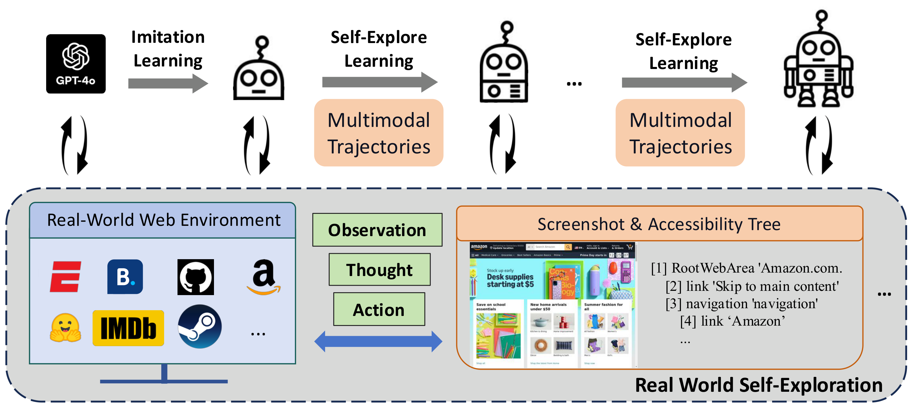
</p>

_Figure 8. OpenWebVoyager first learns web navigation through imitation learning, then iteratively explores real websites, receives GPT-4o feedback, and retains successful trajectories for further training._ (Image source: [He et al. 2025](https://aclanthology.org/2025.acl-long.1336/))

[On-policy Expert Corrections (OEC)](https://proceedings.mlr.press/v306/lauffer26a.html) is a hybrid data collection method that combines on-policy student rollouts with off-policy expert supervision by collecting expert continuations from states reached by the student.
This approach addresses covariate shift in multi-turn agents, where the deployment state distribution diverges from the training distribution.
OEC begins each rollout with the student model and switches to an expert model at a randomly sampled turn, preserving the environment state and interaction history.
The expert completes the task, and the solution is verified through execution.
For software engineering tasks, successful trajectories are selected via unit tests and filtered for repetitive actions.
During fine-tuning, the loss is computed only on the expert continuation, training the student to follow expert actions from student-induced states.
Relying solely on expert trajectories induces severe covariate shift, whereas purely on-policy student trajectories risk reinforcing undesirable behaviors. Consequently, combining clean expert demonstrations with expert corrections on student-induced states can achieve better performance.

<p align="center">
  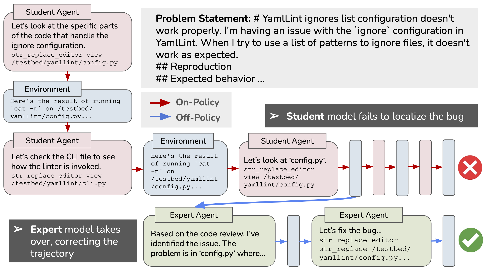
</p>

_Figure 9. An example of a real on-policy expert correction in the SWE agent domain. The student begins the trajectory and fails to localize the bug, but after the expert takes over, it brings the trajectory back on track to finish localization and write and submit a patch._ (Image source: [Lauffer et al. 2026](https://proceedings.mlr.press/v306/lauffer26a.html))

Building on this approach, [Li et al.](https://arxiv.org/abs/2605.12913) introduce a DAgger-style interactive imitation framework.
Instead of a single student-to-teacher transition, trajectories are collected by dynamically interpolating between student and teacher policies at the turn level. The teacher provides the target supervision at every visited state for fine-tuning.
Consequently, this exposes the student to realistic deployment states while preserving dense expert signals, thereby reducing covariate shift.

### Simulator-Based Trajectory Collection

Building and maintaining interactive environments for agent training is particularly expensive.
Unlike standard supervised learning, agent training entails repeated interaction with stateful environments.
Scaling this process necessitates parallel execution across environments that remain strictly isolated, reproducible, and seamlessly resettable.
Simulator-based trajectory collection addresses this challenge by generating synthetic interactions within simulated environments, reducing the need for repeated execution in live, fragile environments.

<p align="center">
  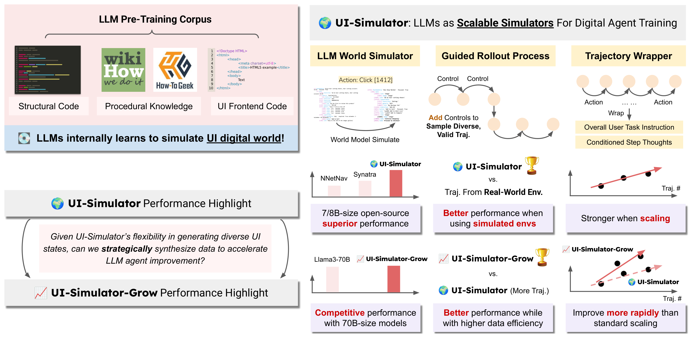
</p>

_Figure 10. Overview and performance highlights of UI-Simulator and UI-Simulator-Grow._ (Image source: [Wang et al. 2025](https://arxiv.org/abs/2510.14969))

[UI-Simulator](https://arxiv.org/abs/2510.14969) uses LLMs as general-purpose digital world simulators to generate agent-training trajectories without repeatedly interacting with real user interfaces.
By taking summaries of past UI states and the current agent action, the LLM directly predicts the next UI state as a structured accessibility tree, complete with text, spatial coordinates, and dynamic attributes.
A teacher agent then rolls out actions inside these simulated states, while a wrapper formats the whole interaction into ready-to-use training data with user goals, step-by-step reasoning, and actions.
To make data collection more targeted, the authors propose UI-Simulator-Grow, which identifies high-value task distributions and synthesizes focused trajectory variants.
Empirical evaluations on WebArena and AndroidWorld demonstrate that agents trained on these synthetic trajectories remain competitive with—or even outperform—open-source agents trained through interactions with real user interfaces, highlighting the potential of simulated data generation for scaling digital agent training.

[WebWorld](https://arxiv.org/abs/2602.14721) is an open-web simulator trained at scale that serves as a simulated web environment.
Trained on 1.06 million real-world web interaction trajectories, WebWorld learns the dynamics of webpage states in response to agent actions.
The model supports multi-step, long-horizon rollouts across diverse state modalities, including HTML, accessibility trees, XML, Markdown, and natural language.
Using WebWorld as a simulated environment, agents can interact with the surrogate system and synthesize training trajectories without querying live websites.
The authors further introduce a data pipeline to synthesize 8,000 trajectories using WebWorld.
Fine-tuning Qwen3-8B on these synthetic trajectories achieves performance gains on both MiniWob++ and WebArena.
This suggests that world models can provide a scalable alternative to collecting agent trajectories directly from live websites.

<p align="center">
  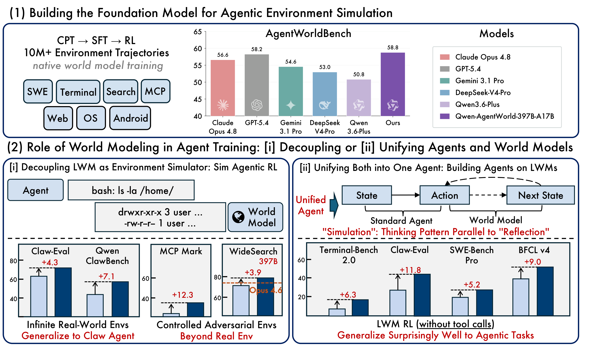
</p>

_Figure 11. Qwen-AgentWorld is a unified language world model spanning seven domains. It enhances agents through two strategies: Decouple, using the world model as an environment simulator, and Unify, using it as the agent foundation model._ (Image source: [Zuo et al. 2026](https://arxiv.org/abs/2606.24597))

Taking world modeling a step further, [Qwen-AgentWorld](https://arxiv.org/abs/2606.24597) builds a more general agent environment simulator covering MCP, Search, Terminal, SWE, Android, Web, and OS.
The model is trained on more than 10 million real-world interaction trajectories through a three-stage CPT, SFT, and RL pipeline, where CPT learns general world-modeling capabilities from environment dynamics, SFT activates next-state prediction, and RL further improves simulation fidelity.
Qwen-AgentWorld aims to serve as a general-purpose environment simulator for scalable and controllable agentic reinforcement learning across diverse real-world environments.

<p align="center">
  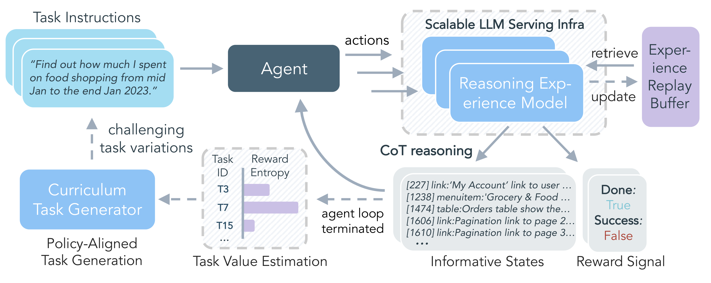
</p>

_Figure 12. DreamGym combines a reasoning-based experience model, replay buffer, and curriculum task generator to synthesize informative trajectories for scalable RL._ (Image source: [Chen et al. 2026](https://openreview.net/forum?id=cf7qpBwttr))

[DreamGym](https://arxiv.org/abs/2511.03773) is a framework for scaling agent reinforcement learning through adaptive experience synthesis. Rather than relying solely on a passive environment simulator, DreamGym combines a reasoning-based experience model, an experience replay buffer, and adaptive task generation into a single training loop. The experience model predicts the next state and feedback from the current state and agent action, while the replay buffer provides real interaction examples to stabilize simulation. As the agent improves, DreamGym automatically identifies informative tasks and generates new task variants, allowing the synthetic training experience to evolve together with the policy. This enables large-scale RL with substantially reduced dependence on repeated real environment interaction.

## A Practical Recipe

These paradigms offer complementary trade-offs rather than competing alternatives. Human demonstrations provide grounded, high-quality supervision but are difficult to scale. Expert trajectories enable automated generation at scale, yet their quality depends on teacher capability and reliable verification. On-policy rollouts faithfully reflect the states encountered during actual execution, but collecting only successful trajectories risks concentrating data on trivial tasks. Simulator-based methods reduce repeated interaction with costly or fragile environments, although their effectiveness depends on simulation fidelity and transfer to real environments. In practice, modern agent training systems increasingly combine these approaches into an integrated recipe: expert or human data establishes a competent base policy, on-policy collection exposes deployment-time failures, and simulated environments expand experience at lower cost.

If you find any issues in my blog, please feel free to contact me at [Jaydencoolca@hotmail.com](mailto:Jaydencoolca@hotmail.com). Thank you!
{: .blog-contact-note role="note"}

## Citation

If you find this blog helpful, please consider citing it as:

> Zhang, Hengxiang. “From Agent Learning to Scalable Agent Training Data.” Blog (Sep 2026).<br> > [https://jaydencoolcc.github.io/Homepage/blog/2026/scaling-training-data-for-agent-learning/](https://jaydencoolcc.github.io/Homepage/blog/2026/scaling-training-data-for-agent-learning/)
> {: .article-citation}

Or use the BibTeX citation:

```bibtex
@misc{zhang2026agenttrainingdata,
  title = {From Agent Learning to Scalable Agent Training Data},
  author = {Zhang, Hengxiang},
  year = {2026},
  month = sep,
  howpublished = {Blog post},
  url = {https://jaydencoolcc.github.io/Homepage/blog/2026/scaling-training-data-for-agent-learning/}
}
```

## References

[1] OpenAI. ["A Practical Guide to Building AI Agents."](https://openai.com/business/guides-and-resources/a-practical-guide-to-building-ai-agents/) OpenAI (2024)

[2] Anthropic. ["Building Effective Agents."](https://www.anthropic.com/engineering/building-effective-agents) Anthropic (2024)

[3] Yao et al. ["ReAct: Synergizing Reasoning and Acting in Language Models."](https://openreview.net/forum?id=WE_vluYUL-X) ICLR 2023

[4] Nakano et al. ["WebGPT: Browser-assisted question-answering with human feedback."](https://arxiv.org/abs/2112.09332) arXiv preprint arXiv:2112.09332 (2021)

[5] Deng et al. ["Mind2Web: Towards a Generalist Agent for the Web."](https://proceedings.neurips.cc/paper_files/paper/2023/hash/5950bf290a1570ea401bf98882128160-Abstract-Datasets_and_Benchmarks.html) NeurIPS 2023 (D&B)

[6] Wang et al. ["OpenCUA: Open Foundations for Computer-Use Agents."](https://proceedings.neurips.cc/paper_files/paper/2025/hash/cc7ae529e945226b0d52ea4ac478c4f3-Abstract-Conference.html) NeurIPS 2025

[7] NVIDIA. ["Building a Synthetic Motion Generation Pipeline for Humanoid Robot Learning."](https://developer.nvidia.com/blog/building-a-synthetic-motion-generation-pipeline-for-humanoid-robot-learning) NVIDIA Developer Blog (2025)

[8] Chen et al. ["FireAct: Toward Language Agent Fine-tuning."](https://arxiv.org/abs/2310.05915) arXiv preprint arXiv:2310.05915 (2023)

[9] Yang et al. ["SWE-smith: Scaling Data for Software Engineering Agents."](https://proceedings.neurips.cc/paper_files/paper/2025/hash/8b86cf5ace600c48fd188efbb8dedec8-Abstract-Datasets_and_Benchmarks_Track.html) NeurIPS 2025 (D&B)

[10] Awadallah et al. ["Fara-1.5: Scalable Learning Environments for Computer Use Agents."](https://arxiv.org/abs/2606.20785) arXiv preprint arXiv:2606.20785 (2026)

[11] Pan et al. ["Training Software Engineering Agents and Verifiers with SWE-Gym."](https://proceedings.mlr.press/v267/pan25g.html) ICML 2025

[12] He et al. ["OpenWebVoyager: Building Multimodal Web Agents via Iterative Real-World Exploration, Feedback and Optimization."](https://aclanthology.org/2025.acl-long.1336/) ACL 2025

[13] Lauffer et al. ["Imitation Learning for Multi-turn LM Agents via On-policy Expert Corrections."](https://proceedings.mlr.press/v306/lauffer26a.html) ICML 2026

[14] Li et al. ["Revisiting DAgger in the Era of LLM-Agents."](https://arxiv.org/abs/2605.12913) arXiv preprint arXiv:2605.12913 (2026)

[15] Wang et al. ["LLMs as Scalable, General-Purpose Simulators For Evolving Digital Agent Training."](https://arxiv.org/abs/2510.14969) NeurIPS 2025 SEA Workshop

[16] Xiao et al. ["WebWorld: A Large-Scale World Model for Web Agent Training."](https://proceedings.mlr.press/v306/xiao26o.html) ICML 2026

[17] Zuo et al. ["Qwen-AgentWorld: Language World Models for General Agents."](https://arxiv.org/abs/2606.24597) arXiv preprint arXiv:2606.24597 (2026)

[18] Chen et al. ["Scaling Agent Learning via Experience Synthesis."](https://openreview.net/forum?id=cf7qpBwttr) ICLR 2026
